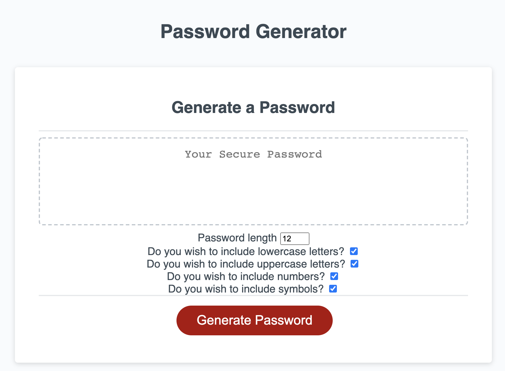

# PasswordGenerator

## Images 




## Description 

```
This application will allow a user to have a password randomly generated for them based off the criteria of their choosing. The criteria includes lower case, upper case, numbers, and symbols. The user can also choose a password length from 8 to 128 characters. 
```

## User Story

```
AS AN employee with access to sensitive data
I WANT to randomly generate a password that meets certain criteria
SO THAT I can create a strong password that provides greater security
```

## Contact

manosalvas2013@gmail.com

- - -

https://github.com/rmanosalvas/homework3


